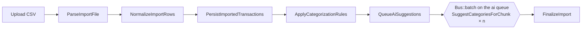

# Transaction Categorizer

A bookkeeping tool that turns client bank and credit card statements into categorized, QuickBooks-ready books. Statements go through a queued import pipeline; deterministic rules categorize what they can, Claude suggests accounts for the rest, and a person approves everything before it's exported.

Built with Laravel 13, Vue 3 + Inertia, Redis + Horizon, and Claude (via Prism or the official Anthropic PHP SDK, your choice).

**Try it locally:** follow [Running locally](#running-locally), then log in as `demo@example.com` / `password`. The demo comes with two clients, a quarter of statements already imported, and work waiting in the review queue.

## What it does

- **Imports statements from different banks.** Each bank account has an import profile describing its CSV layout: column names, date format, and how it signs amounts (one signed column, inverted signs like Amex, or separate debit/credit columns like Capital One). Real-world quirks are handled: byte-order marks, trailing delimiters, overlapping statement periods.
- **De-duplicates safely.** Re-importing a file, or importing a statement that overlaps the last one, never creates duplicates, while two identical coffees on the same day are still kept as two transactions.
- **Categorizes with rules first.** Rules match the payee, bank description or memo (contains, starts with, equals or regex), optionally by direction and amount range. The first match by priority wins.
- **Suggests the rest with AI.** Whatever no rule matched goes to Claude in batches, along with the client's chart of accounts and their recent decisions. Each suggestion has a confidence and a one-line reason, and waits for review.
- **Puts a person in charge.** A review queue lists what needs attention, least certain first, with bulk approve. Correcting a transaction offers to turn it into a rule; approving the same payee to the same account three times suggests one automatically. Over time, rules handle more and the AI (and its cost) handles less.
- **Explains every decision.** An append-only history records who or what categorized each transaction and why ("Rule: Coffee shops", "Manual: Demo Bookkeeper", "AI suggestion (92% confident)").
- **Exports to QuickBooks Online** as balanced journal entries, with a separate "mark as exported" step so nothing goes out twice.
- **Multi-client.** A bookkeeper can manage many clients; owners manage a client's setup, bookkeepers do the day-to-day work.

## How an import works



Each stage is its own queued job in a chain on the `imports` queue, tagged `import:{id}` and `client:{id}` so Horizon can filter to a single import. The import page shows the stages live.

1. **Parse**: the profile's parser (`CsvParser`, resolved by key from a registry) streams the file into an `import_rows` staging table, keeping every original cell for auditing.
2. **Normalize**: dates are parsed strictly in the profile's format, amounts are converted to signed integer cents, and bank descriptions are cleaned into payee names (`SQ *BLUE BOTTLE COFFEE #0423 OAKLAND CA` becomes `Blue Bottle Coffee Oakland`). A bad row is marked failed with a reason; it never fails the import.
3. **Persist**: each row gets a fingerprint and is inserted with `insertOrIgnore` against a unique `(bank_account_id, fingerprint)` index; rows that already exist are marked duplicates.
4. **Rules**: active rules run over the new transactions.
5. **AI**: only now is it known what's left, so this stage chunks the remaining transactions and inserts a batch into the running chain. The import finalizes when every chunk has finished; a chunk that fails just leaves its transactions for manual review.
6. **Finalize**: counts and status are recorded, including the AI model and tokens used.

The full data model and implementation notes are in [docs/architecture.md](docs/architecture.md).

## Design decisions

- **Money is integer cents, parsed from the string.** `"1,234.56"`, `"(45.00)"` and `"-$5"` go straight to cents without ever touching a float (`19.14` as a float times 100 is `1913.999…`).
- **Two kinds of failure.** A file in the wrong format fails the import with a readable message ("Missing expected column(s): Posting Date…"). A single bad row is set aside with its reason. Anything unexpected shows up as a failed job in Horizon and marks the import failed.
- **Every pipeline stage is safe to retry.** Parsing won't restage rows that later stages already linked to transactions, normalizing only touches pending rows, and persisting relies on the unique index.
- **Fingerprints use the raw description plus an occurrence index**, not the cleaned payee, so improving the payee clean-up never changes existing fingerprints, and same-day duplicates within one file stay distinct.
- **One writer for categorizations.** `CategorizationService` appends to the history, keeps exactly one current decision per transaction, refuses another client's accounts, and enforces precedence: a person beats a rule, a rule beats an AI suggestion.
- **AI output is never trusted blindly.** Suggestions for transactions outside the request or account codes that don't exist in the client's chart are dropped. Nothing the AI says is approved automatically.
- **AI calls are bounded.** Chunks are rate limited across all workers and retry through provider rate limits and outages with backoff. The SDK's own retries are switched off so there's exactly one retry policy, owned by the queue. The chart of accounts and examples sit in a cached system prompt shared by every chunk of an import.
- **The AI provider is swappable.** Categorizers implement one interface; the Prism and official-SDK versions share the prompt, schema and parsing, so switching is a config change.
- **Exports have no side effects.** Downloading is a plain GET; marking a batch as exported is a deliberate step taken after QuickBooks accepts the file, so a failed import can just be downloaded again.
- **Tenancy is explicit.** Client-owned models share a `BelongsToClient` trait with a `forClient()` scope, routes use scoped bindings (`/clients/{client}/rules/{rule}` 404s for another client's rule), and a policy separates owners from bookkeepers.

## Running locally

Requirements: PHP 8.3+ (with `pcntl`), Composer, a current Node LTS, and Redis.

```bash
git clone <this repo> transaction-categorizer && cd transaction-categorizer
composer install
cp .env.example .env
php artisan key:generate
touch database/database.sqlite
php artisan migrate --seed
npm install
composer dev
```

`composer dev` starts the web server, Vite, Horizon and the log viewer together. Open http://localhost:8000 and log in as `demo@example.com` / `password`. The queue dashboard is at `/horizon`.

Sample statements live in [`database/seeders/statements/`](database/seeders/statements); upload one again to see de-duplication, or try `tests/Fixtures/statements/wrong_format.csv` to see a file rejected.

### AI configuration

| `AI_CATEGORIZER` | What happens                                                                                                                 |
| ---------------- | ---------------------------------------------------------------------------------------------------------------------------- |
| `demo` (default) | Keyword matching, no API calls. Every suggestion is labelled "Demo suggestion" so it can't be mistaken for AI.               |
| `prism`          | Claude through [Prism](https://prismphp.com), Laravel's provider-agnostic LLM package. Needs `ANTHROPIC_API_KEY`.            |
| `sdk`            | Claude through the official [Anthropic PHP SDK](https://github.com/anthropics/anthropic-sdk-php). Needs `ANTHROPIC_API_KEY`. |
| `disabled`       | Skip the AI stage; anything rules miss goes straight to review.                                                              |

The two Claude drivers send exactly the same prompt and JSON schema (`CategorizationPrompt`) and differ only in transport, so they can be compared side by side. `AI_MODEL` defaults to `claude-haiku-4-5`, the least expensive current model: picking an account from a short list is a simple, high-volume task.

Seeding always uses the demo categorizer, so it never spends money. `php artisan demo:reset` wipes the database and uploaded files and reseeds, which is handy between demo runs.

## Testing

```bash
composer test          # Pint, PHPStan (level 7) and Pest
npm run check          # lint and formatting (Vite+)
npm run types:check    # vue-tsc
```

The Pest suite covers the parsers against anonymized fixtures from each bank format, money parsing, payee clean-up, fingerprinting, the full pipeline (including retries, duplicates, wrong-format files and unexpected failures), rule matching, the AI stage against Prism's fake and against the real Anthropic SDK with a fake HTTP transport (including invented account codes, refusals and non-retried errors), tenancy and authorization on every route, and the export's debit/credit balance. Tests run with the `sync` queue and AI disabled unless a test opts in.

## Project layout

```
app/
  Categorization/      RuleEngine, LearnedRuleSuggestions, Ai/ (categorizers, few-shot examples)
  Exports/             QuickBooksJournalCsv
  Imports/             Parsing/ (CsvParser, registry), Normalizing/ (money, payees, dates), Fingerprinter
  Jobs/Imports/        One job per pipeline stage, plus the AI chunk job
  Services/            ImportService, CategorizationService, ClientOnboardingService
resources/js/pages/    imports/, review/, transactions/, rules/, exports/
tests/                 Feature/ and Unit/, with statement fixtures in Fixtures/statements/
docs/architecture.md   Data model, pipeline and design notes
```

## Not built yet

- Bank feeds (Plaid) and OFX/QFX files; CSV only for now.
- Pushing to QuickBooks through its API rather than a CSV export.
- Screens for managing clients, the chart of accounts, bank accounts and import profiles (they're created by the onboarding service and seeders today).
- Real-time updates over websockets; the import page polls while an import runs.
